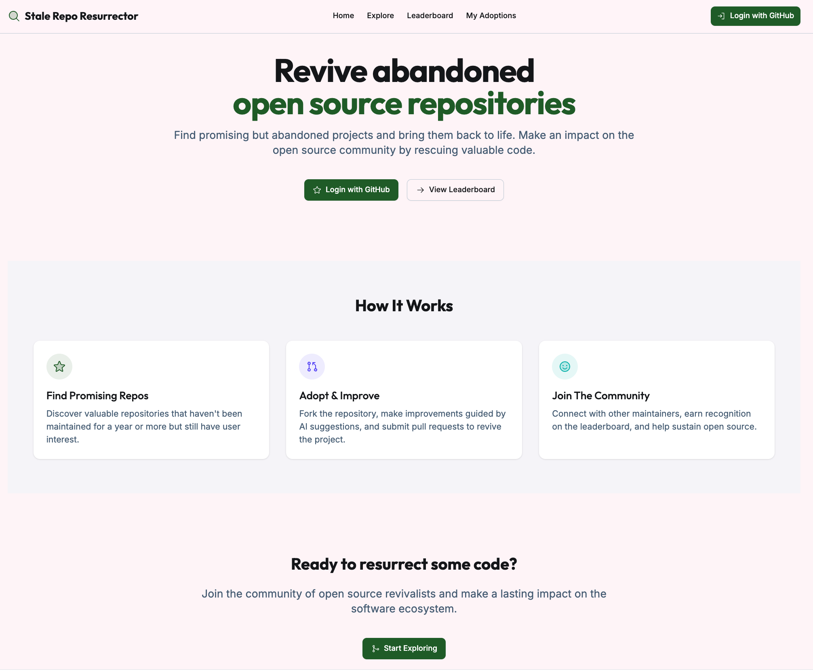

# 🧟‍♂️ Repo Resurrector

> Breathe new life into abandoned open source projects.

---

## 🛠 What Is Repo Resurrector?

**Repo Resurrector** is a web application that identifies **abandoned but promising GitHub repositories** and empowers you to bring them back to life.

Whether you're a developer looking to contribute meaningfully, a maintainer hunting for your next project, or just someone who loves open source, Repo Resurrector is your launchpad.

---

## 🚀 Try It Now

🔗 **[Get started in seconds →](https://gh.io/repo-resurrect)**  
Try out a simulation of the project.

---

## ✨ Features

- 🔐 **GitHub OAuth Login** – One-click sign-in with your GitHub account.
- 🔎 **Automated Repository Scanning** – Discover projects based on activity trends and staleness metrics.
- 🧮 **Staleness Scoring** – Quantifies how "dead" a repository is using smart heuristics.
- 🧭 **Feed of Repos to Rescue** – Curated list of neglected but valuable open source projects.
- 🤖 **AI-Powered Suggestions** – Get intelligent ideas for how to improve or contribute to each repo.
- 🏆 **Community Leaderboard** – Track top contributors and earn your place among the open source heroes.

---

## 💡 Why It Matters

Many valuable open source projects fall into disrepair every year. Repo Resurrector helps surface the best of them, making it easy for contributors like you to make a real impact.

Open source isn't just about starting something new—sometimes it's about finishing what someone else started.

---

## 🧩 Contributing

We welcome contributions to the Repo Resurrector platform itself! Check out [CONTRIBUTING.md](CONTRIBUTING.md) to learn how to get involved.

---

> _Revive. Reinvent. Reignite the open source spirit._

